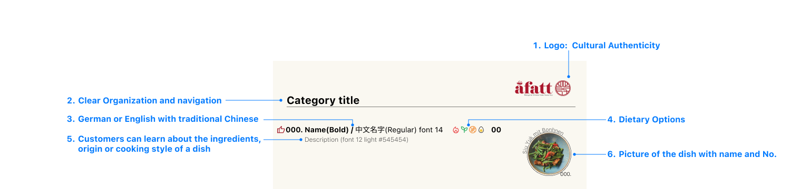
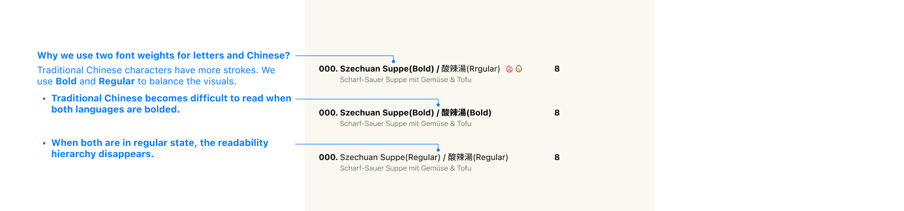
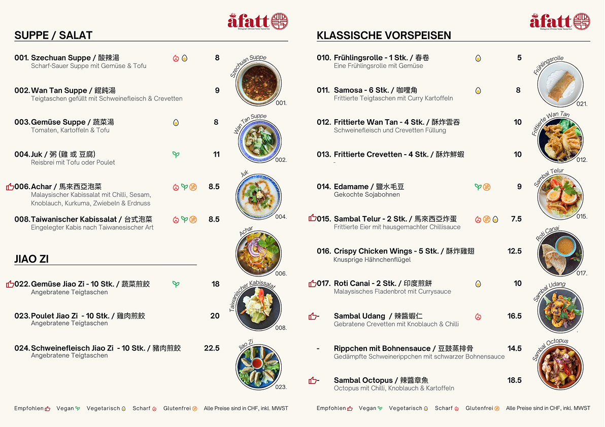

## The brief

##### Showcasing Authentic Asian Flavors and Culture in Zürich!

People come to the restaurant not only to enjoy authentic dishes but also to experience the exotic culture. Both the flavors and the cultural representation need to be localized to the location. As a Taiwanese, Chinese, and Malaysian restaurant in Zurich, how can it showcase its unique characteristics within Switzerland and through its menu?

##### Crafting a Menu that Represents Our Restaurant and Serves Every Guest

The menu is an integral part of the service and represents the restaurant. With clear dish names and descriptions, and a variety of spicy, vegan, vegetarian, and gluten-free options, the restaurant ensures that every guest can find something to delight their palate while staying true to its rich culinary heritage.

#### Challenge

Design a menu for an authentic Asian restaurant in Switzerland that balances cultural integrity with local preferences, supports diverse dietary needs, and provides an **intuitive**, **scalable framework** that the restaurant team can **maintain and update efficiently**, without compromising usability or brand consistency.

#### Solution

- Developed a menu system that functions as a living design framework: modular layout components, multilingual content blocks, and dietary tagging allow the team to update or expand offerings without redesigning. The system integrates cultural authenticity, usability, and operational scalability, serving both diners and restaurant staff efficiently.

- The system streamlines both the customer experience and internal menu management, enabling the restaurant to scale and update offerings seamlessly.

#### What the engagement included

Competitive audit, user research, prototyping, UX design and usability testing.

## What we made

The prototypes demonstrate how the menu system operates as a modular, scalable framework, supporting both user experience and operational flexibility. Each component—from headers to dish layouts and footers—is designed to be reusable and adaptable, ensuring updates are seamless without compromising usability or brand consistency.

#### Header and Dish section

The header clearly presents restaurant branding and navigation, while dish sections use modular blocks to display names, descriptions, images, dietary labels, and pricing. This setup allows new dishes or translations to be added effortlessly, keeping the menu consistent and easy to navigate.

#### Use two font weights for both Latin letters and Chinese characters

Two font weights are applied consistently to both Latin and Chinese characters, ensuring readability, visual hierarchy, and cultural authenticity. Modular typographic components allow the restaurant team to maintain a cohesive style when updating menu content.

#### Footer information

The footer provides key practical details for diners: recommended dishes, dietary information, and VAT-inclusive pricing. These elements are part of the modular system, so they can be updated independently as the menu evolves. This ensures customers always see accurate, helpful information while the restaurant team can maintain consistency without redesigning layouts.

#### Final Prototype for One of the Menu Pages

The final prototype demonstrates how the modular system comes together to create an intuitive, visually cohesive menu. Every element—from dish sections to dietary labels—can be updated or expanded without redesigning the page, showing the system in action.

### Figma Prototype

Here are two version can view it one flow 1 and flow 2.

<iframe title="A Fatt menu — interactive Figma prototype" style="border: 1px solid rgba(0, 0, 0, 0.1);" width="100%" height="100%" loading="lazy" src="https://embed.figma.com/proto/lbIqPM0s0yiJ9KG8iN6aPW/Affat?page-id=1%3A22&node-id=4004-1023&viewport=-582%2C870%2C0.18&scaling=contain&content-scaling=fixed&starting-point-node-id=4004%3A1023&show-proto-sidebar=1&embed-host=share" allowfullscreen></iframe>

## The decision that mattered

The menu system codifies layout, typography, color, and iconography into modular components that can be reused across menus. It functions as a living system: scalable, editable, and aligned with operational workflow, allowing the restaurant to independently manage updates while maintaining consistent user experience.

##### If you’re in Zürich, don’t miss A Fatt at [Limmatstrasse 189, Zürich](https://maps.app.goo.gl/NJdaqyhLYFeS5Xhs6) — definitely worth a try!

## The result

The A Fatt menu project delivered a culturally authentic and accessible menu that reflects Malaysian, Chinese, and Taiwanese cuisine while catering to a Swiss audience. By integrating multilingual content, dietary-friendly labeling, and intuitive layouts, the menu enhances the dining experience for customers.

Transferring the Figma design into a Canva file created a **flexible menu system** that allows the client to update dishes, add translations, or adjust dietary options independently. This empowered the restaurant team to manage and evolve the menu without needing repeated design work, reinforcing long-term operational scalability and brand consistency.

## What happened next

After the Figma and Canva delivery we took the idea further on our own time.
**menuGen** turns structured menu data into an interactive editor and a
print-ready PDF — multilingual content, dietary tagging, modular layouts. It is
built for the general problem rather than for A Fatt, who work in Canva and are
happily still on the system above.

  <a href="/projects/menugen/">Read the menuGen case study →</a>

## What this shows

#### Who did the work

A design engagement, run by one of us end to end — the content structure, the
modular system and the production files the restaurant still edits today. No
specialist was brought in, because at this size none was needed. We say that
here for the same reason we [say which of us did what on Sprachschule
Yang](/projects/sprachschule-yang/): you should always know who did what before
you hire anybody.

#### What it means for your project

The deliverable was not a menu. It was a system the client's own team has been
running without us since 2024 — which is the test we would want applied to
anything we hand you.

It is also how a design job turns into software here. Nobody set out to build a
product; the repeating problem showed up while doing the work, and the same
practice was able to take it further. That only happens when the people drawing
it are the people who could build it.

