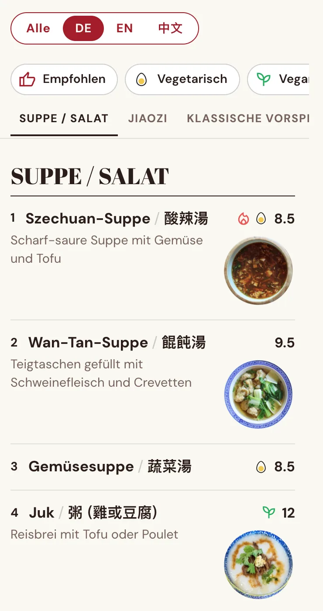
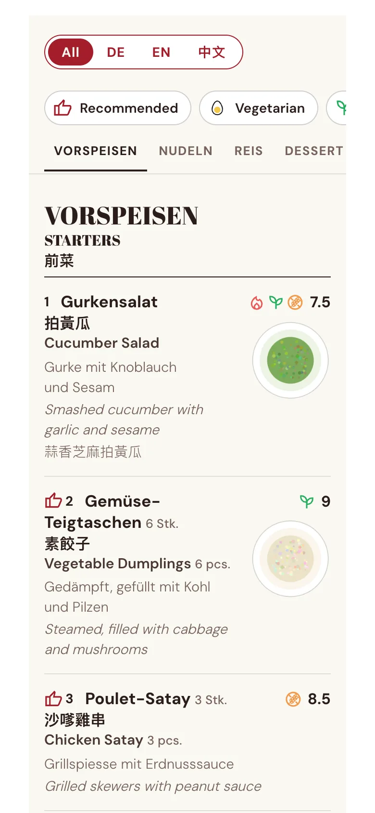
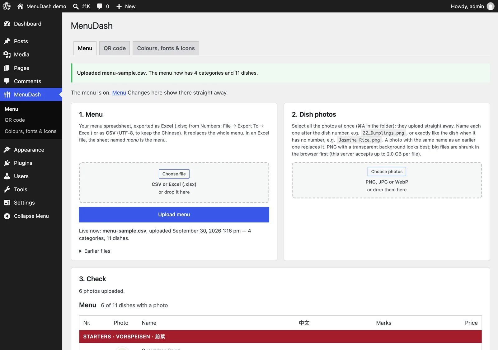
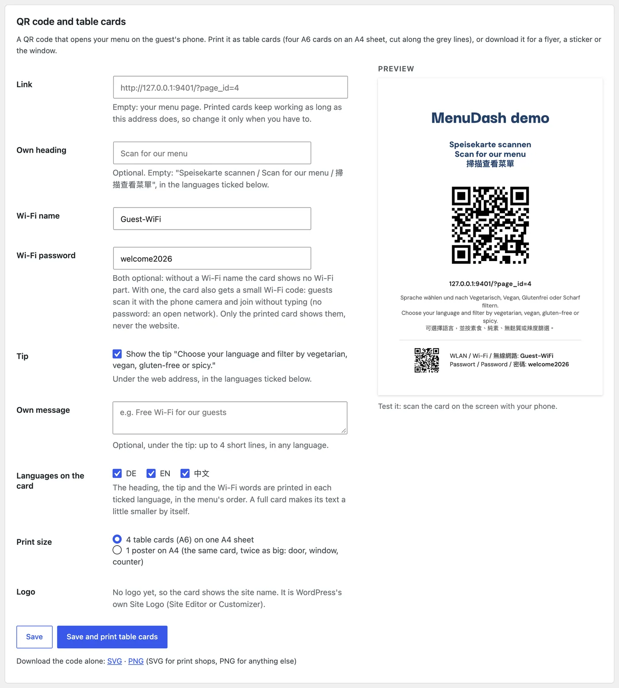
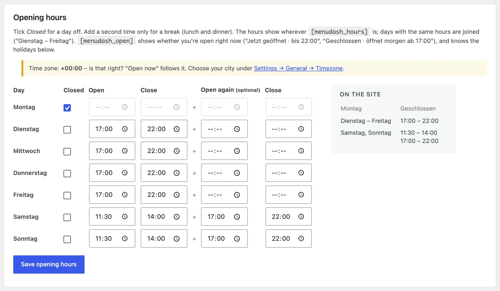
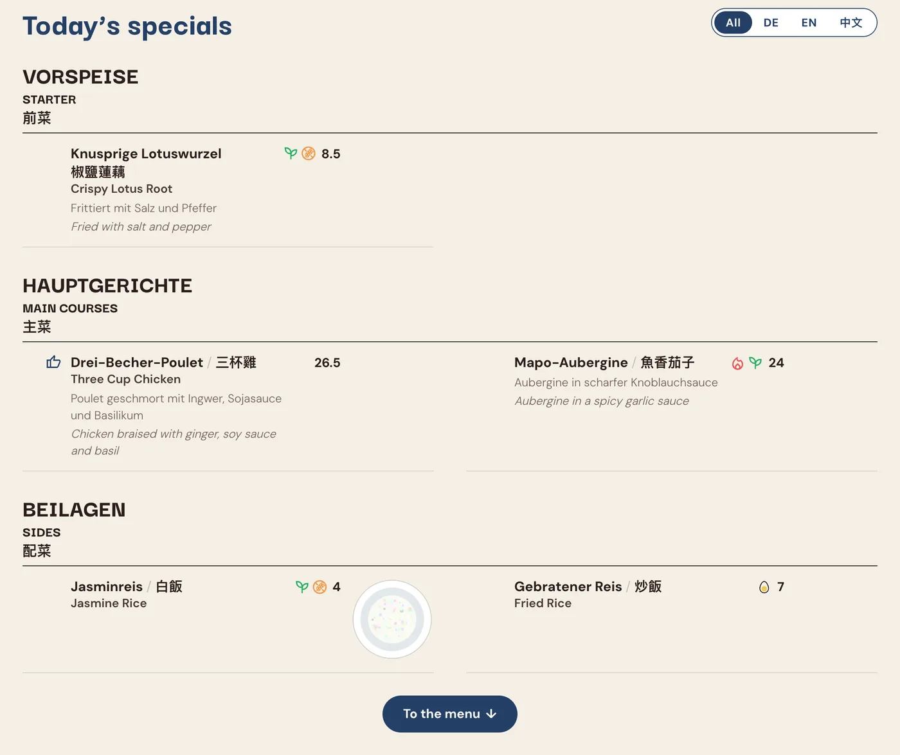
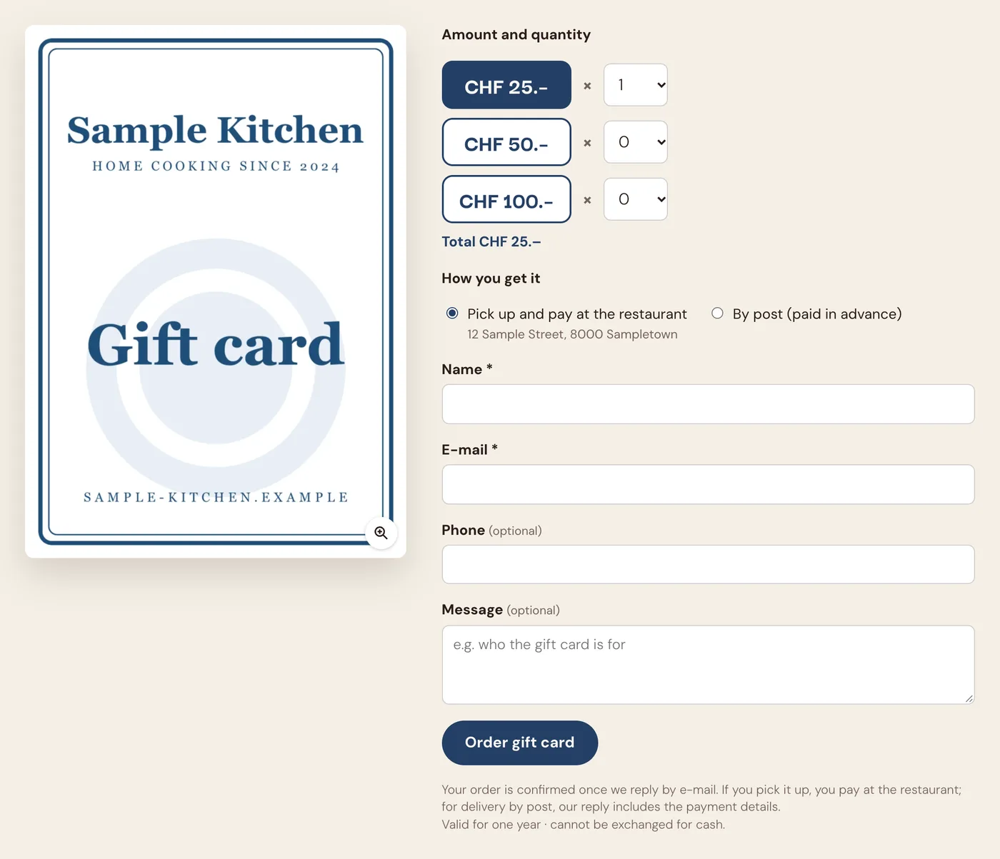
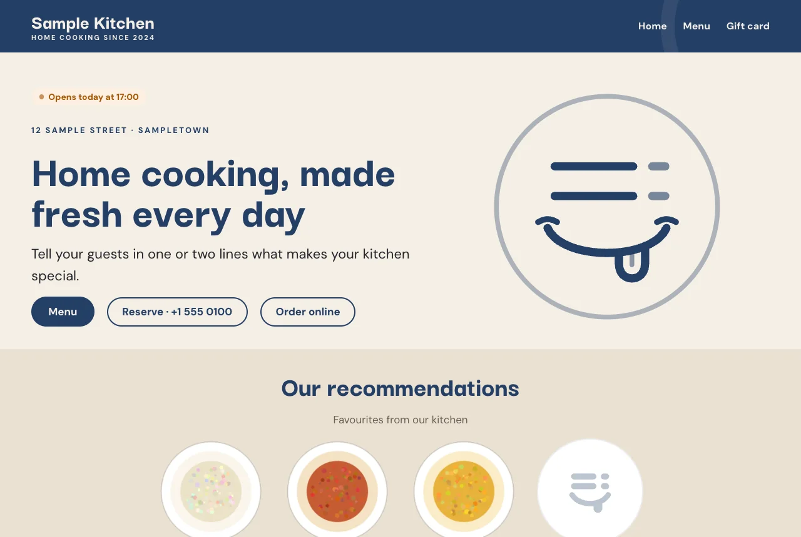
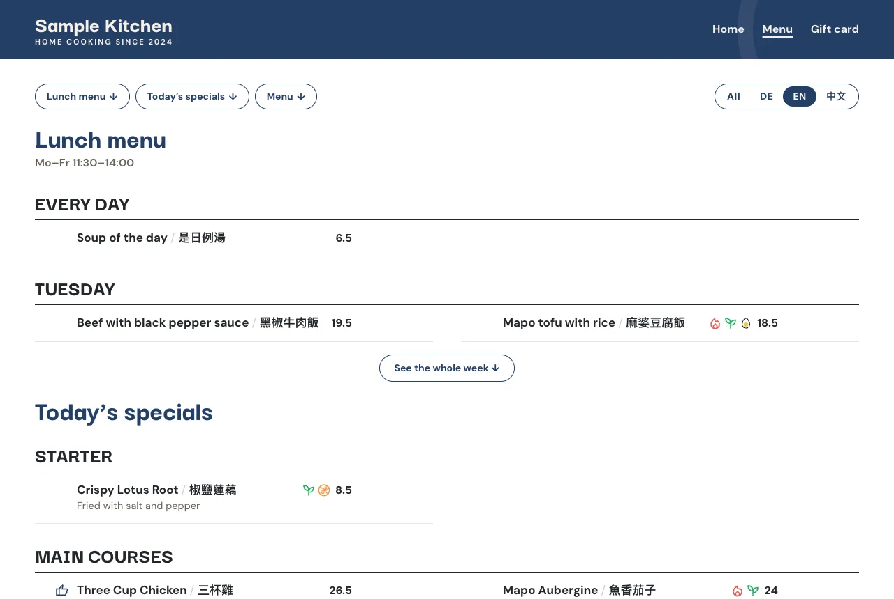

## The problem

A restaurant’s menu lives in a spreadsheet. The website menu is usually a copy of it: a PDF, a picture, or a page someone typed in by hand. Every price change means updating it twice, and the website is the copy that falls behind.

MenuDash makes the spreadsheet the website menu. You upload the file you already keep, and the menu page updates by itself.

## Running on afatt.ch

A Fatt, a Malaysian Chinese restaurant in Zürich, runs its menu on MenuDash: 110 dishes in three languages, with photos and diet marks, from the same spreadsheet the staff already edit. [See the menu on afatt.ch](https://afatt.ch/menu/).

## What guests get

- The menu in German, English and Chinese, all at once or one language at a time. The choice is remembered.
- Filters for vegetarian, vegan, gluten-free, spicy and not spicy, plus the dishes the restaurant recommends.
- A photo next to each dish, large with one tap.
- A page that reads well on a phone, and that search engines can read too: the menu is real text, not a PDF or a picture.

## What the owner does

- Upload the menu spreadsheet, as Excel or CSV. A short report says what was read, and warns about anything odd, like the same dish twice with different prices.
- A file that is not a menu is refused, so the live menu never breaks. The last five uploads can be put back with one click.
- Upload all dish photos at once. A check list shows every dish with its photo, and which ones are still missing.
- Print QR table cards or a poster straight from the dashboard, with the Wi-Fi on them if they like.
- Fill in where the meat and fish come from, as Swiss rules require in writing. It is translated into the menu languages and shown under the menu.
- Pick colours and, if they want, their own diet icons, so the menu looks like their restaurant.

*Dashboard screenshots show the sample menu that ships with MenuDash.*

## Add-ons

MenuDash covers the menu. Three add-ons keep the rest of what guests look up on a restaurant website current, from the same dashboard page.

### Restaurant

Address, phone, delivery and reservation links, entered once. Opening hours with an “open now” badge, and a holiday notice that appears and disappears by itself.

### Specials

Today’s specials and the lunch menu of the week, each from its own short spreadsheet, in the same style and languages as the menu.

### Gift Cards

A gift card order form. The order arrives by e-mail; a switch pauses it, and spam is kept out.

## MenuDash Theme

A full restaurant website around MenuDash: a home page with the recommended dishes, opening hours and a map, the lunch menu and specials above the menu, and a Call · Directions · Menu bar on phones. The address and hours are typed once, in MenuDash, and every page shows them.

*Theme screenshots show its sample restaurant.*

## Packages

We set MenuDash up for restaurants. Each package is a one-time setup; the add-ons come with a yearly fee, which pays for their updates and for help when something changes.

| Package | What’s in it | Fees |
|---|---|---|
| **Menu** | MenuDash: the menu, photos, filters, QR cards and colours | One-time setup. Care plan optional. |
| **Menu + Restaurant** | MenuDash with the Restaurant add-on | One-time setup, plus a yearly fee |
| **Complete** | MenuDash with Restaurant, Specials and Gift Cards | One-time setup, plus a yearly fee |
| **Complete + website** | Everything above, on the MenuDash Theme or on a design made for the restaurant | One-time setup, plus a yearly fee |

Add-ons can be added to any package later. Every package is a fixed price, agreed in writing before we start.

For prices, write to us with your current menu and your website address. We send the price list and a written estimate for your restaurant.

**How setup works.** We agree the package and the price. The restaurant sends the menu spreadsheet, dish photos, logo, address and opening hours, and a login to its WordPress site; no site yet, and we set one up. We install it, fill everything in and check every dish against its photo before anything goes live. The owner gets a short guide with a screenshot for each thing they will do: a new menu, new hours, a holiday.

## Open source, so you are not locked in

MenuDash and the MenuDash Theme are open source, on GitHub for anyone to see ([MenuDash](https://github.com/yingshiuan/menudash), [MenuDash Theme](https://github.com/yingshiuan/menudash-theme)). Your menu never depends on us: if you stop working with us, it keeps running. What you pay us for is the setup, the add-ons, and someone who answers when something needs to change.

**Good to know:**

- It runs on WordPress. A site on Wix or Squarespace does not fit, and we will say so.
- German, English and Chinese are built in. Other languages are possible, but they are extra work.
- One menu per site.

