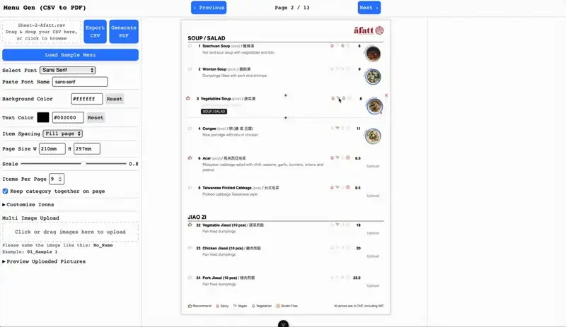
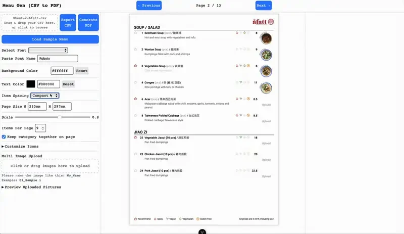
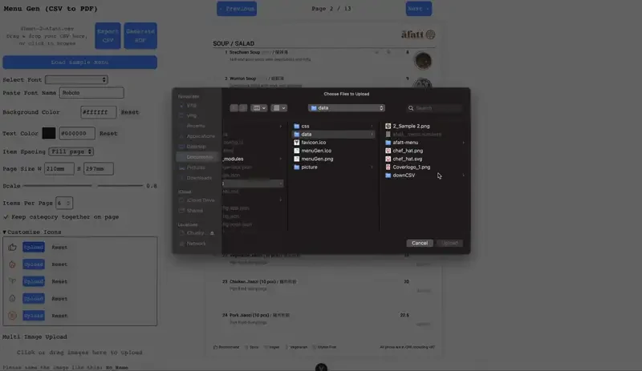
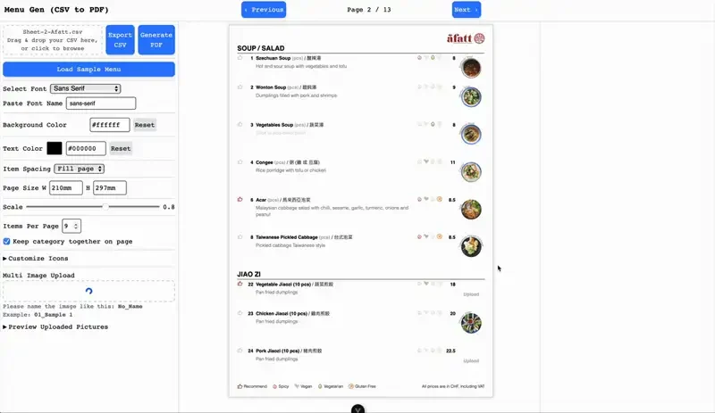
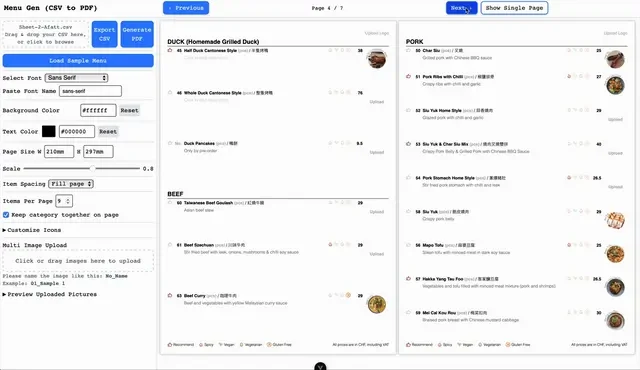
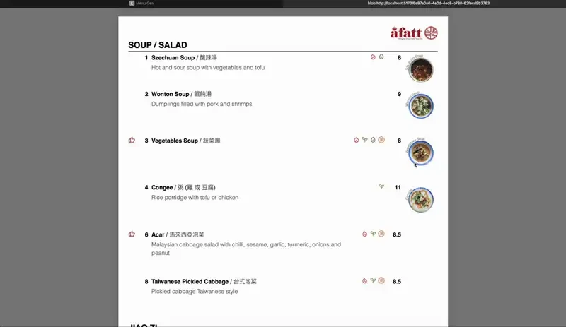

## The brief

There wasn't one. This is the project we set ourselves.

[A Fatt](/projects/afatt) hired us to design a menu, and we delivered a modular
system in Figma and Canva that they still use. They work in Canva and are happy
there, so we did not push a tool change on them — the switching cost would have
landed on the restaurant, not on us.

What was left over was the *general* problem. A restaurant owner with no design
training still has to lay out a menu by hand every time a price moves or a dish
comes off. Even in Canva, every change is layout work. menuGen is the answer to
that, built for the category rather than for one client.

## What we made

A web app that takes structured menu data and gives back a print-ready PDF.
Content in, layout handled.

Menu content arrives as a spreadsheet — the format restaurants already keep their
prices in — and lands in an editor where every field is editable in place.

Dietary and preparation icons are assigned per dish, multilingual by default,
because that was the actual requirement behind the original A Fatt job.

The live preview is the page. Not an approximation of it.

## The decision that mattered

**Print fidelity, and it forced the architecture.**

A menu that looks right in a browser is worthless if it prints soft. Getting from
an on-screen layout to a print-ready PDF means guaranteeing that every image
lands at the right resolution — and naive rendering does not guarantee it,
because assets resolve at different times. Start rendering before an upload has
finished processing and you get a soft photograph, which nobody notices until
the printer hands back a box of menus.

So the renderer sits behind an asynchronous job queue. The queue makes the
pipeline's ordering deterministic: nothing renders until every asset it depends
on is ready.

That single constraint is why the rest of the machinery exists — an asset
pipeline that takes an upload through crop, compression and inlining before it
ever reaches the renderer, and category-aware pagination that keeps a section
from splitting across a page break where a diner would lose it.

Smaller decisions in the same spirit: dishes auto-number within their category
and reuse the gaps, so deleting a dish doesn't leave a hole in the numbering or
force a manual renumber down the page.

## The result

menuGen is **deployed and live** at
[menugen.insdash.ch](https://menugen.insdash.ch), and
[the source is public](https://github.com/yingshiuan/menuGen).

**It has no users.** A Fatt, the restaurant the idea came from, chose to stay on
the Canva system we handed over — which was the right call for them, and we
didn't push it. We publish menuGen because the interesting part is the
engineering, not a usage number we'd have to invent.

  

## What this shows

A design engagement here can become working software, because the same practice
does both halves. You are not paying a designer to produce a specification for
somebody else to interpret.

That is the whole argument, and menuGen is the clearest instance of it:
[a menu design job](/projects/afatt) that turned into a product.

