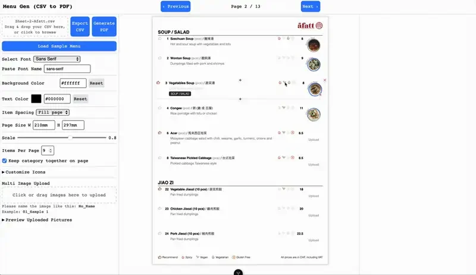
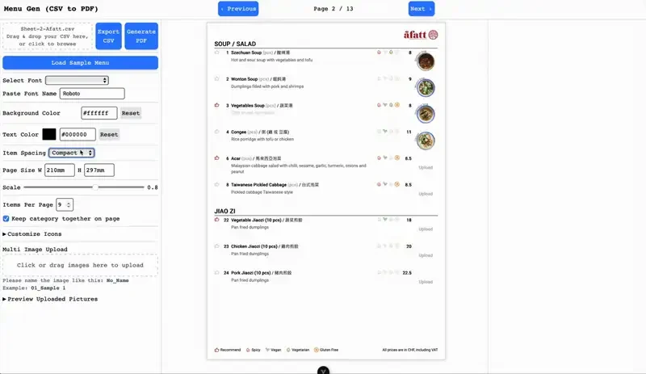
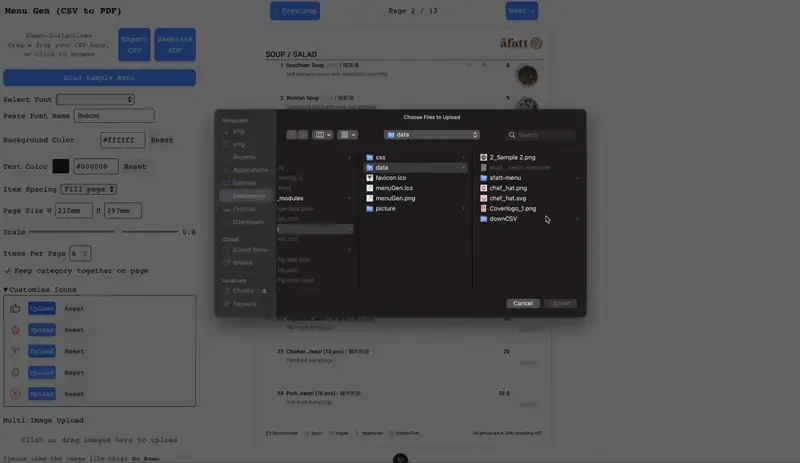
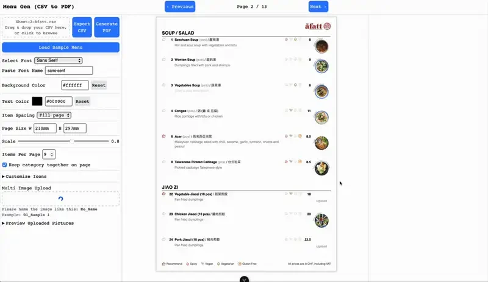
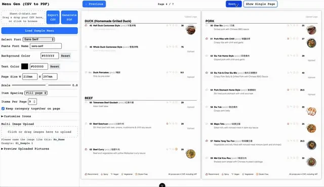
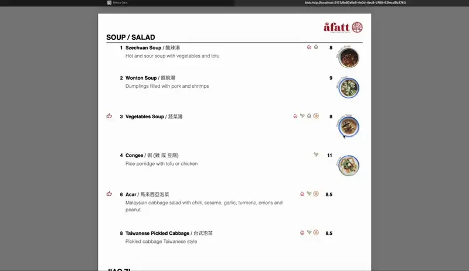
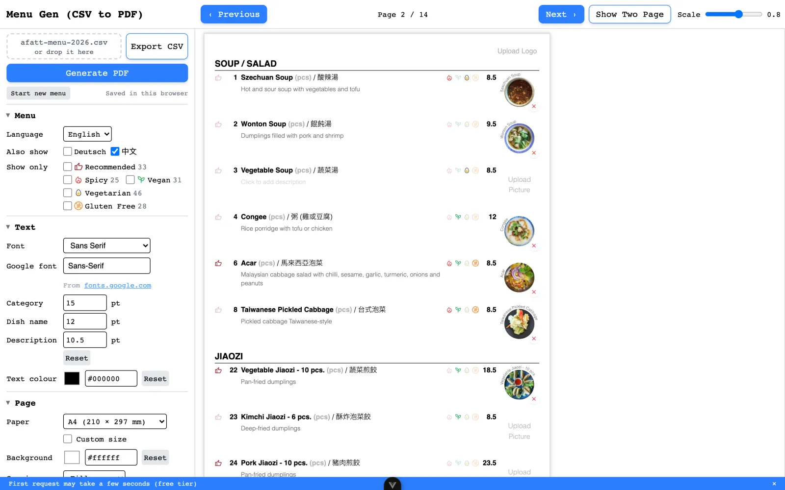

## The brief

There wasn't one. This is the project we set ourselves.

[A Fatt](/projects/afatt/) hired us to design a menu, and we delivered a modular
system in Figma and Canva. They worked in Canva and were happy there, so we did
not push a tool change on them — the switching cost would have landed on the
restaurant, not on us.

What was left over was the *general* problem. A restaurant owner with no design
training still has to lay out a menu by hand every time a price moves or a dish
comes off. Even in Canva, every change is layout work. menuGen is the answer to
that, built for the category rather than for one client.

## What we made

A web app that takes structured menu data and gives back a print-ready PDF.
Content in, layout handled.

Menu content arrives as a spreadsheet — the format restaurants already keep their
prices in — and lands in an editor where every field is editable in place.

Dietary and preparation icons are assigned per dish, multilingual by default,
because that was the actual requirement behind the original A Fatt job.

The live preview is the page. Not an approximation of it.

## The decision that mattered

**Print fidelity, and it forced the architecture.**

A menu that looks right in a browser is worthless if it prints soft. Getting from
an on-screen layout to a print-ready PDF means guaranteeing that every image
lands at the right resolution — and naive rendering does not guarantee it,
because assets resolve at different times. Start rendering before an upload has
finished processing and you get a soft photograph, which nobody notices until
the printer hands back a box of menus.

So the renderer sits behind an asynchronous job queue. The queue makes the
pipeline's ordering deterministic: nothing renders until every asset it depends
on is ready.

That single constraint is why the rest of the machinery exists — an asset
pipeline that takes an upload through crop, compression and inlining before it
ever reaches the renderer, and category-aware pagination that keeps a section
from splitting across a page break where a diner would lose it.

Smaller decisions in the same spirit: dishes auto-number within their category
and reuse the gaps, so deleting a dish doesn't leave a hole in the numbering or
force a manual renumber down the page.

## Back to a real menu

In September 2026 we loaded A Fatt's current menu into menuGen: more than 100
dishes in three languages, most of them with dietary icons. The sample data had
never tested the tool like that, and a real menu found the gaps quickly.

- **Three languages per dish.** Every name, description and category now holds
  English, German and Chinese. You pick the main language and choose which
  others appear after it, so one spreadsheet gives an English menu, a German
  one, or either with the Chinese names alongside.
- **A menu for one diet.** "Show only" filters by dietary icon, with a count
  next to each. Tick Vegan and the preview, the page count and the PDF all
  become the vegan menu; vegan dishes count as vegetarian too. Editing still
  sees the whole menu, so nothing gets lost while it is filtered.
- **Characters the font doesn't have.** 叄 in 叄峇 (sambal) is missing from
  the Chinese typeface we use and printed as an empty box. It now falls back to
  a font that has it.
- **Photos matched by name.** Dish photos pair with their dishes by filename,
  whatever the language, capitalisation or spacing.

The result is that menuGen can now produce the same printed menu as the Canva
system we designed for A Fatt in 2024, straight from their spreadsheet.

## What the no taught us

We showed menuGen to A Fatt, and they kept the Canva system. That answer taught
us more than the build did.

What we took from it: a restaurant owner judges a menu by what the guest sees.
menuGen made the work behind the menu easier, but the guest still got the same
printed page as before, so there was nothing to switch for.

So when we went back in 2026 and found one price being kept by hand across an
English, a German and a vegan and vegetarian menu, we changed what the guest
gets instead: one online menu that every guest filters by language and diet on
their own phone. That became [MenuDash](/projects/menudash/), and this time the
answer was yes.

**One Excel file, one menu system.** A dish is one row, with a field per
language and a flag per diet. The same file uploads to both tools: menuGen
prints it, MenuDash publishes it. Together they are one way to manage a menu:
change a price in the file once, upload it and the website menu is current,
open it in menuGen and the new print PDF is ready.

## The result

menuGen is **deployed and live** at
[menugen.insdash.ch](https://menugen.insdash.ch), and
[the source is public](https://github.com/yingshiuan/menuGen).

**It has no users yet.** A Fatt's menu is what we test it against, but the
restaurant doesn't use menuGen. We publish it because the interesting part is
the engineering, not a usage number we'd have to invent.

  

## What this shows

A design engagement here can become working software, because the same practice
does both halves. You are not paying a designer to produce a specification for
somebody else to interpret.

That is the whole argument, and menuGen is the clearest instance of it:
[a menu design job](/projects/afatt/) that turned into a product, and then,
because the client said no, into [the one they took](/projects/menudash/).

