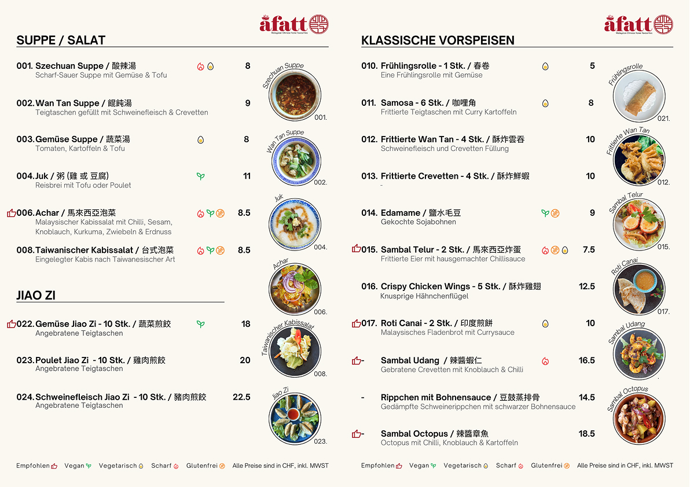
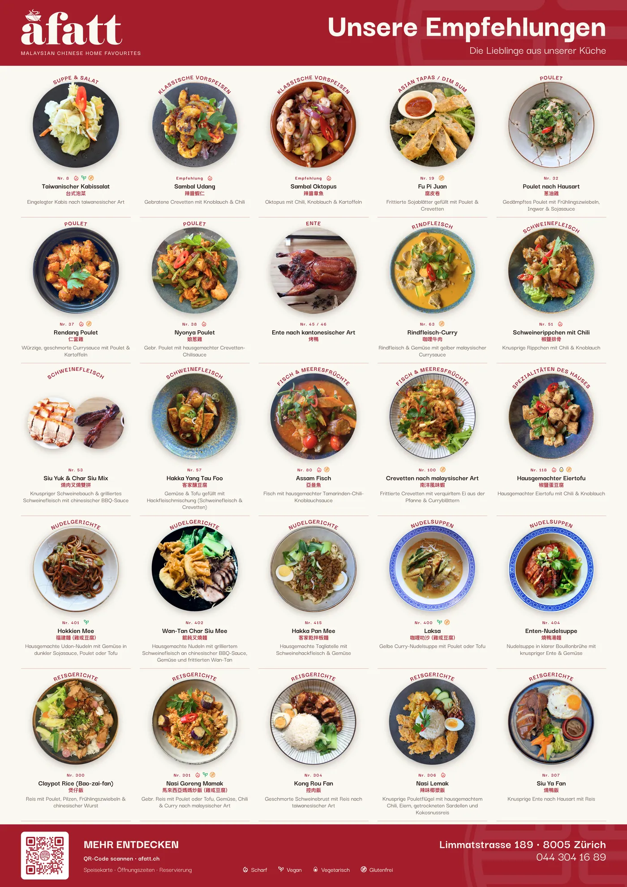
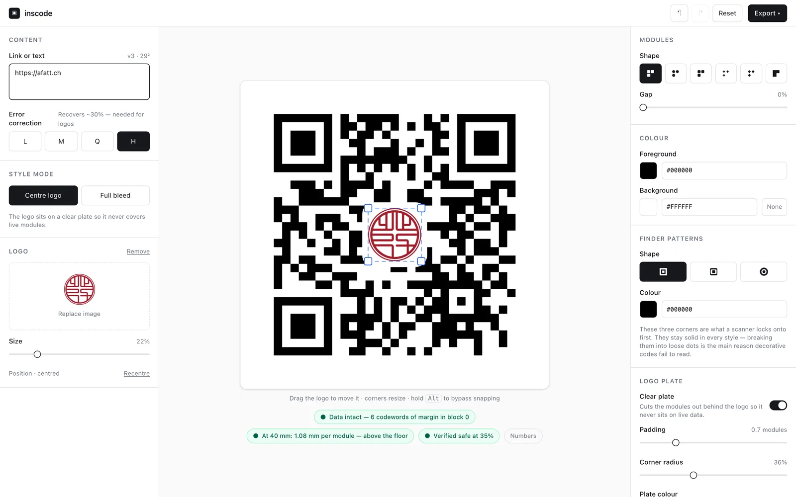
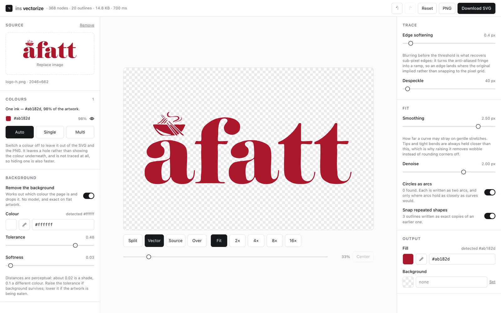
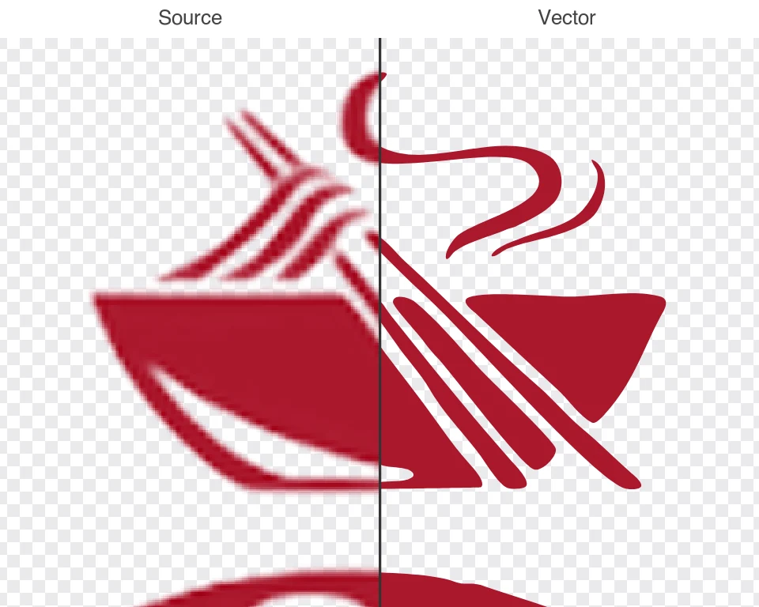
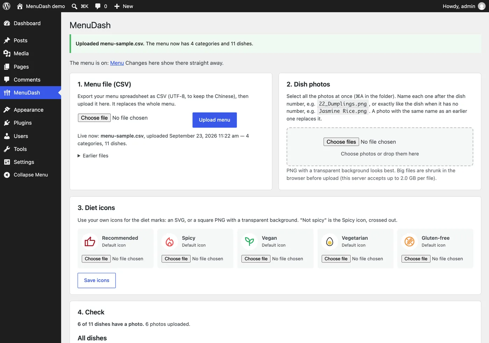

## The brief

A Fatt is a Malaysian Chinese restaurant in Zürich. In 2024 they asked us to redo their menu. Two years later they came back for new work. This page covers both, and the tools the work turned out to need.

A menu is never finished. Prices change, dishes come and go, and every version lives in several places at once: the printed menu, the posters, the website, and each language. None of that is hard work, which is exactly why it drifts back to a designer every few months, or quietly goes out of date. So we keep the menu as data, and make everything else a view of it.

## 2024: a menu the staff run themselves

We surveyed A Fatt's diners, built personas from the answers, and tested printed drafts with real diners at the table. The menu is trilingual (German, English, Traditional Chinese), and every dish shows its diet: vegan, vegetarian, gluten-free, spicy.

We delivered it as a modular system in Canva, the tool the restaurant already used, so the staff add dishes, change prices and edit names themselves. No retainer, on purpose: the handover was the product. Two years on they still run it, and it took a new dessert section without a redesign.

The full 2024 process is in the [original case study](/projects/afatt/).

## 2026: they came back

A Fatt returned as a paying client for a dessert section, an exterior flyer with a QR code, two A2 posters, gift cards and name cards. We built the new pieces as code.

#### One dish list, every poster

Every piece is a web page at its real print size, with the brand's colours and fonts defined once. The menu is a single dish list. Mark a dish as recommended and it joins the recommendations poster. Tag it vegan or vegetarian and it joins the veggie poster. A page that overflows is flagged before it reaches the printer. When a price changes, it changes once, and every poster follows.

#### A QR code checked by a decoder

The flyer hangs outside the restaurant with a QR code carrying their logo. A logo uses up a QR code's error correction, and a code that has gone too far still looks fine on screen and fails on the wall. So we built a small tool, [inscode](https://github.com/yingshiuan/inscode), that measures how much the logo can cover, checks the code at its printed size, and reads back every file it writes before calling it done. The printed flyer scans.

#### A logo that holds at poster size

We rebuilt their logo as clean vectors, the seal from true circles and arcs and the wordmark refitted, so it stays sharp at A2. We have since turned that approach into an in-house vectoriser for other clients' logos.

## The same menu, in print and on the web

**In print: [menuGen](/projects/menugen/).** Designing the 2024 menu showed us the part a handover can't remove: every price change is still layout work. menuGen is our own tool for that problem: a menu spreadsheet in, a print-ready PDF out, in every language and diet version from one sheet. A Fatt looked at it and kept the system we had handed them, which is the handover doing its job. We test menuGen against their menu, and they don't use it.

**On the web: MenuDash.** A Fatt's website runs on WordPress, so instead of a new product we built a plugin for the tool they already log into. The owner uploads the menu spreadsheet, and guests read it in three languages and filter it by diet. A wrong file gets a clear report and the old menu stays online, and the last five uploads can be put back with one click. It is [open source](https://github.com/yingshiuan/menudash), built for their site, and not yet installed at the time of writing.

## What this shows

#### Who did the work

Both engagements were run by one of us, end to end: the research, the menu system, the print work, and the tools. We say that here for the same reason we [say which of us did what on Sprachschule Yang](/projects/sprachschule-yang/): you should always know who did what before you hire anybody.

#### What it means for your project

We don't sell more software than a business needs. The 2024 menu is theirs to run, the print work stays with us, and the web menu goes into the site they already have. When a question keeps coming back, we build the small tool that answers it, and we check the result with a machine, not by eye.

