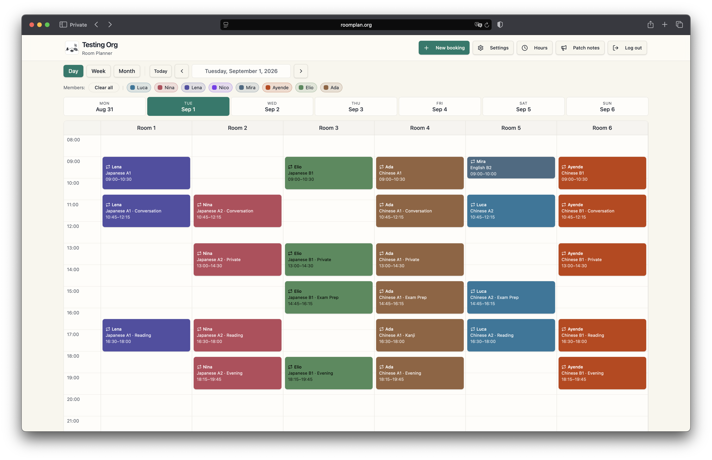
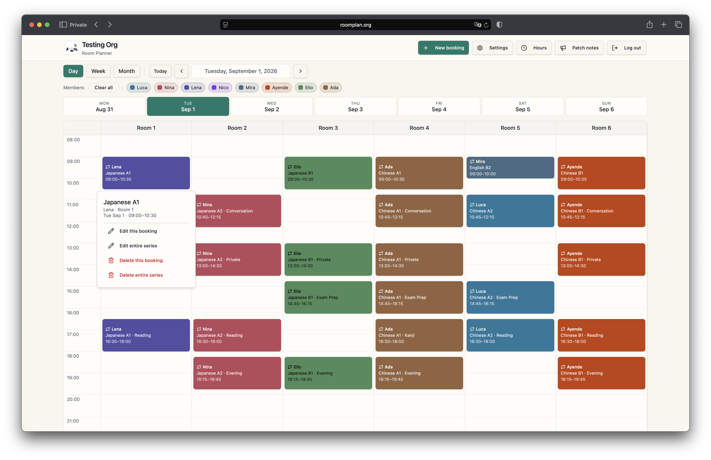
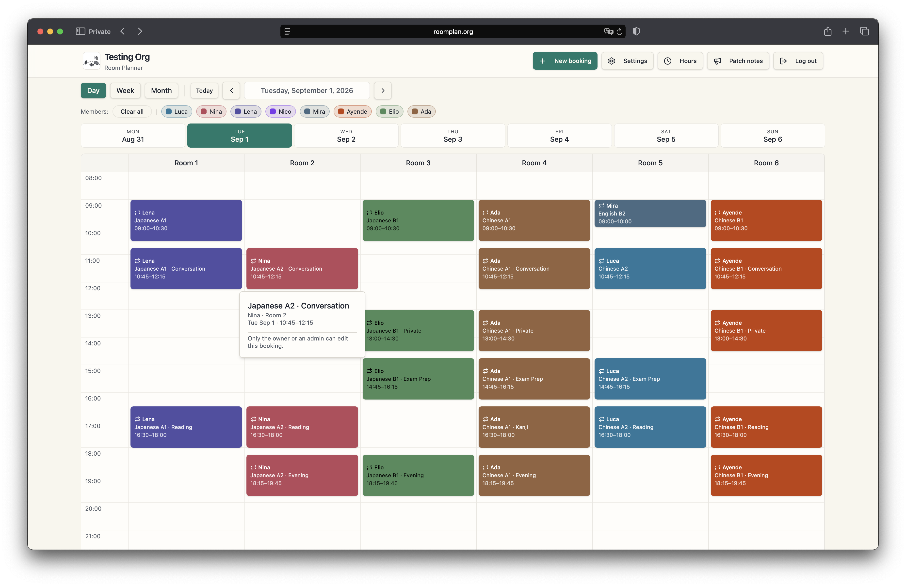
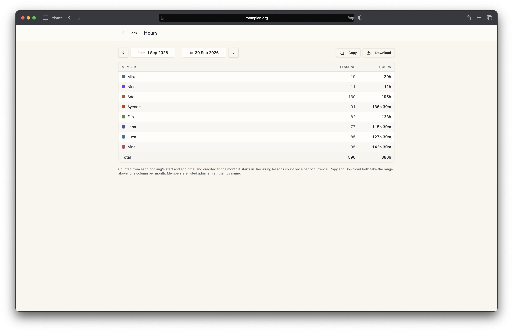
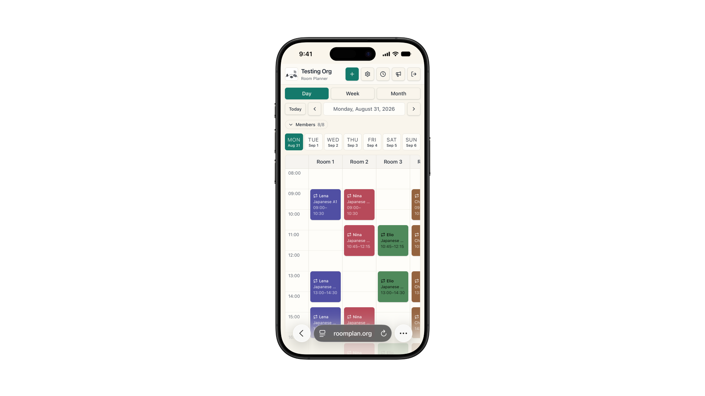
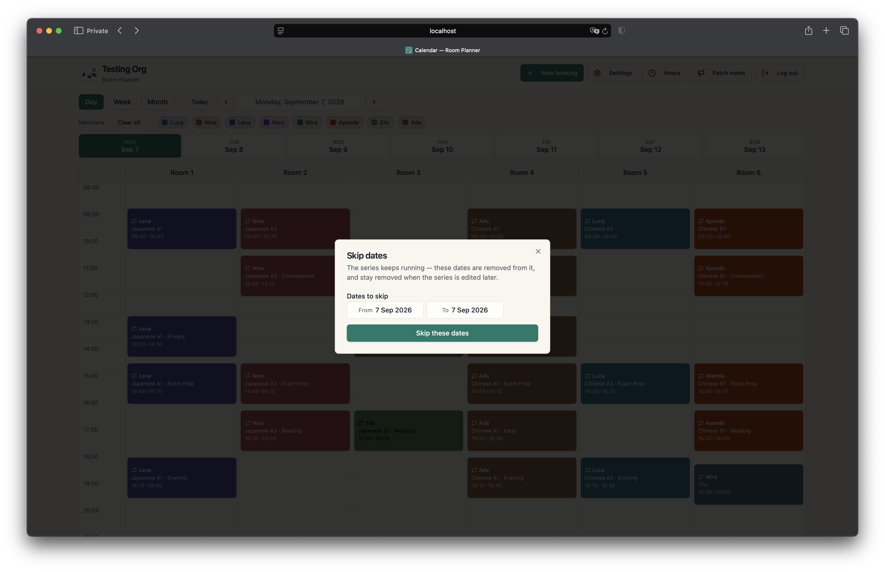

## The brief

Sprachschule Yang is a Chinese and Japanese language school in Zürich Wiedikon.
Six teachers, six rooms, two owners administering the timetable.

They ran their booking on a commercial scheduling product. When its price went
up, the question landed in an uncomfortable place: they were paying for a
package built for organisations many times their size, and using a fraction of
it. Renewing meant paying more for capacity they would never touch. Not renewing
meant no scheduling at all.

They asked us whether a custom replacement made commercial sense — and if so, to
scope, price and deliver it.

## The decision that mattered

#### Whether to build at all.

This is the part of the engagement that carried the value, and it is worth being
precise about how it was decided. We counted what the school actually used: how
many rooms, how many people, which of the product's features appeared in a
typical week, and what would break if each one disappeared. Then we costed the
alternatives over three years, including the part most estimates leave out —
what it costs to keep a custom system alive after it ships.

At this size, building won. The requirement was small, stable and unlikely to
grow: a school with six rooms in one building does not wake up needing
multi-site resource planning. That combination is exactly when a subscription
priced for scale stops making sense.

It is equally worth saying when it would not have won. Had the school been
opening locations, or had the timetable needed to talk to payroll and invoicing,
the answer would have been to keep renting. **Build-vs-buy is a judgment about a
specific business at a specific size, not a preference.**

## What we made

A scheduling system the school owns, covering what they actually do: teachers
book their own classes, owners administer the whole calendar, six rooms, no
double-bookings.

That last one is doing more work than it sounds like. A term of lessons is
booked as a series rather than one evening at a time, so the check has to run
across every date in it — and if a single one of those rooms is already taken in
week nine, **the whole series is refused and the clashing dates are named back to
you.** The alternative is a term that looks booked in September and falls apart
in November.

#### The access model, defined during requirements

Two roles in a hierarchy — **teachers hold edit rights over their own bookings,
owners over everything.** The split is scope, not read-versus-write.

The value is *when* that was decided. Settled during requirements, a role split
costs one conversation. Retrofitted after the build, it costs a data migration
and a revision of every query that assumed a single kind of user. This is the
cheapest decision in the project and the most expensive one to postpone.

Teachers see that same schedule in full. What changes is what they can touch —
their own lessons open, a colleague's does not.

#### Who did what

Both of us — which here is the whole studio.

We are two people with deliberately different halves. One is a **senior software
engineer** — the database, the access rules, the deploy, the parts that decide
whether a system is still standing in year three. The other is a **product
engineer** — the conversation with the owner, what gets built and what does not,
and the interface people actually put their hands on. **Between us that runs from
infrastructure through to design, with nobody in the middle for the intent to get
lost on.**

On this project the product engineer ran the requirements with the owner, made
the build-vs-buy call, wrote the scope and the estimate, and defined the access
model. The software engineer implemented it and took it to production in July.

**Since August it has run the other way.** The new feature work — the hours
report, the mobile pass, the term breaks, the Postgres migrations underneath
them — is written by the product engineer and reviewed by the software engineer
before anything merges. **Nothing
reaches the school's live schedule on one person's say-so**, which matters more
on a system a business runs its week on than anything we could say about our own
process.

## What the school still could not do

**Nobody at the school could say how many hours anyone had taught.**

Neither could the software they had been renting. Working it out meant opening
the calendar at the end of the month and counting by hand, teacher by teacher —
a job small enough to put up with and large enough to get wrong, every month,
for as long as anyone could remember.

The second release, live at the end of August 2026, took three things off them.

#### An hours report

Lessons and hours per person over any date range, a column per month, copied or
downloaded as a spreadsheet. The number you invoice on now comes out of the
system instead of out of a calculator.

One thing about it is worth saying plainly, because it is the kind of decision
that never shows up in a demo: **it will not print a number it cannot stand
behind.** Ask it for a range too large to read in one pass and it says so,
rather than returning a confident total that is quietly missing the busiest
week. These figures decide what people get paid. A wrong one costs more than a
missing one.

#### A calendar that survives a phone

The time column stays put when you scroll sideways to a later room, so a lesson
can never appear on screen without the hour it starts.

#### A colour per teacher that nobody else holds

On a grid of six rooms and eight people, colour is how you find your own lessons
without reading a single word. Two teachers sharing one is not a cosmetic
problem — it is a timetable you have to check twice. So the palette was widened
and every teacher now draws in a colour nobody else in the school has, **the
bookings already in the system included.** Those had to be repaired rather than
reassigned: people had been teaching in those colours for months.

## Then they asked for an app

The school wanted a native app on top of the scheduler. **We told them not to
buy one.**

What they actually wanted was to reach the schedule quickly from a phone, and
that is a much smaller thing than an app. A native build would have added push
notifications, offline access, and a window with no browser chrome. For eight
people checking which room is free at four o'clock, none of the three was the
need.

So they got an icon. We drew the mark, wired it in, and showed them how to put
the schedule on their home screen — two lines of code in place of a project we
would have been paid to build.

The savings from leaving a subscription are only real if the people who replaced
it are still willing to talk you out of spending.

## A deleted lesson that came back

A term of weekly classes has holidays in it, and taking one out meant deleting
those lessons from the series. That did not hold. **Change anything about the
series afterwards — nudge its end date, move its time — and every deleted lesson
quietly came back.**

Nothing on screen said so. The hours simply went up, for a teacher who had not
touched a thing. That was a defect in software we delivered, sitting directly
under the figures that decide what people get paid, and it is the kind that
never throws an error for anyone to report.

The third release, in September 2026, fixed the cause rather than the symptom.

#### A holiday is now part of the term

Open a lesson in a series, choose **Skip dates**, and give it a from and a to.
The lessons in between come off the calendar, the series carries on either side,
and the hours drop by exactly what was removed. The gap is written into the
series rather than cut out of it, so no later edit can fill it back in. Christmas
and the February holidays are two gaps in one course, not two courses.

Deleting a single lesson from a series now records the same kind of gap, and the
button says **Skip this date** rather than Delete, because that is what it does.
Every gap can be restored on its own, and restoring puts back only the dates that
were missing — a lesson someone had moved to another afternoon stays where they
put it.

#### What we chose not to repair

We did not go back and convert the gaps made before the fix. A date missing from
a term might have been deleted, or its lesson moved to another day, and the data
cannot tell those two apart. Converting them would have meant rewriting a live
timetable on a guess. **The release changed no booking that was already there** —
the same refusal to guess as the hours report, applied to the calendar.

It was built and tested against a local copy of the database before it went
anywhere near the one the school's timetable lives on.

## The result

In production since July 2026. **Eight people across two roles — two owners
administering the whole schedule, six teachers scoped to their own — booking six
rooms.** The subscription is gone, and the second release landed at the end of
August without the school losing a day of scheduling.

We hold the maintenance contract and the feature work — the arrangement we would
recommend to anyone leaving rented software, because the savings are only real
if somebody is still looking after the thing in year two.

And here it is running — the same schedule read three ways: a day for a teacher
checking a Tuesday, a week for whoever is covering a room, a month for planning
a term.

  <video
    controls
    preload="none"
    playsinline
    poster="/media/projects/sprachschule-yang/roomplan-views.jpg"
    style="width:100%;height:auto;display:block;margin:0 auto;">
    <source src="/media/projects/sprachschule-yang/roomplan-views.mp4" type="video/mp4" />
    Day, week and month views of the same schedule.
  </video>

The repository is private, so there is no code to show here — and for the same
reason nothing you see above is the school's own timetable. It is the delivered
software running on a demonstration organisation we keep for the purpose: the
teachers, the courses and the bookings in it are invented.

## What this shows

The useful work was not the calendar. It was knowing what to build, what not to
build, and saying which before anyone had committed a budget to it — and then
still being there in August to say it again about the app.

That is the same question we would ask about your problem, and the answer is
sometimes *keep paying the subscription*.

